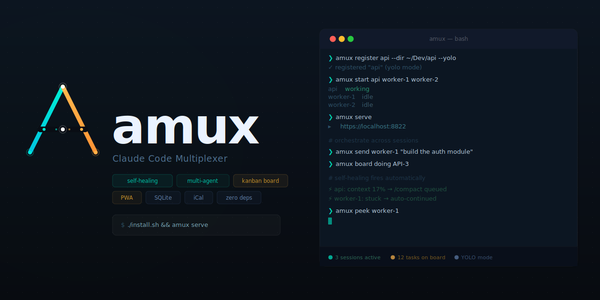

<p align="center">
  <a href="https://github.com/mixpeek/amux/stargazers"></a>
  <a href="https://github.com/mixpeek/amux/blob/main/LICENSE"></a>
  <a href="https://amux.io"></a>
  <a href="https://apps.apple.com/us/app/amux-agent-multiplexer/id6760410435"></a>
  <a href="https://amux.io/changelog/"></a>
</p>

<h3 align="center">💼 Want it done for you? → <a href="https://amux.io/concierge/">amux.io/concierge</a></h3>

<p align="center">
  <b>Run, build &amp; grow your business, all from your phone.</b><br/>
  We set up your first workflow automation, teach your team to build more, and run it all for you.<br/>
  <a href="https://amux.io/concierge/"><b>→ Schedule an onboarding call</b></a>
</p>

---

**Open-source control plane for AI agents.** Run dozens of parallel agent sessions from your browser or phone — with a web dashboard, kanban board, notes, CRM, email, browser automation, slash-command skills, and agent-to-agent orchestration. Self-healing, single-file, zero external dependencies. Works with Claude Code, Codex, and Gemini CLI via tmux.

> **[amux.io](https://amux.io)** · [Getting started](https://amux.io/guides/getting-started/) · [FAQ](https://amux.io/faq/) · [Blog](https://amux.io/blog/)

<video src="amux.mp4" width="920" autoplay loop muted playsinline></video>

```bash
git clone https://github.com/mixpeek/amux && cd amux && ./install.sh
amux register myproject --dir ~/Dev/myproject --yolo
amux start myproject
amux serve   # → https://localhost:8822
```

**Requirements:** Python 3.10+, tmux 3.2+, and at least one of: Claude Code, Codex CLI, or Gemini CLI.

> **License:** [MIT + Commons Clause](LICENSE) — free to use, modify, and self-host. Commercial resale requires a separate license.

---

## What's New

- **Calendar events** — a real events layer that syncs out to Google/Apple Calendar (via an iCal feed), alongside toggleable task and board-issue layers that stay in-app. Create with **+ Event**.
- **Urgent alerts** — `amux alert "..."` fires an in-app push **and** an iMessage/SMS to the owner. A fire alarm any session can pull; configured in Settings → Alerts.
- **[amux tunnel](https://amux.io/features/tunnel/)** — expose any localhost port at a stable public HTTPS URL (`amux tunnel start 3000`). Your machine dials out, so there's no inbound port to open. Requires an amux cloud subscription.
- **[YOLO mode on by default](https://amux.io/changelog/)** — new sessions auto-approve tool prompts so agents never block during overnight runs. Opt out per-session if you need interactive review.
- **[Board status gates](https://amux.io/changelog/)** — configurable checklists gate cards from moving to `done`/`verified`, preventing the failure mode of marking work done before it's confirmed in production.
- **[Saved messages](https://amux.io/changelog/)** — store canned prompts in the DB and trigger them from the ⋮ menu in any session — one tap, no copy-pasting from notes.

[Full changelog →](https://amux.io/changelog/)

---

## Why amux?

| Problem | amux's solution |
|---------|----------------|
| Claude Code crashes at 3am from context compaction | **[Self-healing watchdog](https://amux.io/features/self-healing/)** — auto-compacts, restarts, replays last message |
| Can't monitor 10+ sessions from one place | **[Web dashboard](https://amux.io/features/web-dashboard/)** — live status, token spend, peek into any session |
| Agents duplicate work on the same task | **Kanban board** with atomic task claiming (SQLite CAS) |
| No way to manage agents from your phone | **[Mobile PWA](https://amux.io/features/mobile-pwa/)** + native iOS app — works anywhere, offline support |
| Agents can't coordinate with each other | **[REST API orchestration](https://amux.io/features/agent-coordination/)** — send messages, peek output, claim tasks between sessions |
| Agents operate in a vacuum — no shared context | **Channels** — 1:1 inter-session chat with @mentions so agents can coordinate in real time |
| No persistent knowledge between sessions | **Notes** — markdown documents agents can read, write, and reference across sessions |
| No way to automate recurring work | **Scheduler** — named cron-style recurring jobs with built-in management UI |

---

## Key Features

### Agent infrastructure
- **Self-healing** — auto-compacts context, restarts on corruption, unblocks stuck prompts. [Learn more →](https://amux.io/features/self-healing/)
- **Parallel agents** — run dozens of sessions, each with a UUID that survives stop/start
- **Agent orchestration** — agents discover peers and delegate work via REST API + shared global memory. [Learn more →](https://amux.io/features/agent-coordination/)
- **Channels** — 1:1 inter-session messaging with @mentions so agents can chat, delegate, and coordinate in real time
- **Kanban board** — SQLite-backed with auto-generated keys, atomic claiming, custom columns, iCal sync
- **Conversation fork** — clone session history to new sessions on separate branches
- **Git conflict detection** — warns when agents share a dir + branch, one-click isolation
- **Token tracking** — per-session daily spend with cache reads broken out

### Dashboard & mobile
- **Web dashboard** — session cards, live terminal peek, file explorer with markdown editor, search across all output. [Learn more →](https://amux.io/features/web-dashboard/)
- **Mobile PWA** — installable on iOS/Android, Background Sync replays commands on reconnect. [Learn more →](https://amux.io/features/mobile-pwa/)
- **Native iOS app** — [available on the App Store](https://apps.apple.com/us/app/amux-agent-multiplexer/id6760410435)

### Built-in tools
- **Notes** — full markdown notes system with rich editor, find-in-page, and inter-session sharing
- **CRM** — contacts, companies, interaction logs, follow-up tracking, and tags
- **Email** — send, reply, and read email via the Gmail API (with your real Gmail signature auto-appended), plus a Mail.app fallback for non-Gmail accounts
- **Browser automation** — shared Playwright instance with saved auth profiles, screenshots, and an AI agent mode
- **Skills / slash commands** — project-level custom commands (e.g. `/commit`, `/review-pr`) that agents can invoke
- **Scheduler** — named recurring jobs with cron expressions and a management UI
- **Calendar** — three toggleable layers (events, tasks, board issues); real events sync out to Google/Apple Calendar via an iCal feed
- **Urgent alerts** — a fire-alarm channel any session can use to reach you immediately (in-app push + iMessage/SMS)
- **File explorer** — browse agent working directories, preview files, edit markdown with in-page search
- **Tunnel** — publish any localhost port at a stable public HTTPS URL, no inbound firewall hole ([amux cloud](https://amux.io/cloud/))

### Architecture
- **Single file** — one Python file with inline HTML/CSS/JS. Edit it; it restarts on save. [Learn more →](https://amux.io/features/single-file-architecture/)

---

## How It Works

### Status Detection

Parses ANSI-stripped tmux output — no hooks, no patches, no modifications to Claude Code.

### Self-Healing Watchdog

| Condition | Action |
|-----------|--------|
| Context < 50% | Sends `/compact` (5-min cooldown) |
| `redacted_thinking … cannot be modified` | Restarts + replays last message |
| Stuck waiting + `CC_AUTO_CONTINUE=1` | Auto-responds based on prompt type |
| YOLO session + safety prompt | Auto-answers (never fires on model questions) |
| `/rate-limit-options` (any session, fleet-wide) | Auto-presses 1, records reset time, auto-resumes at reset |

#### Fleet-aware rate-limit handling

When a single Max/Pro account's usage cap is hit, every active Claude Code
session on that account blocks at the same `/rate-limit-options` prompt
within seconds. amux's watchdog detects this fleet-wide, presses option 1
("Stop and wait for limit to reset") on each blocked session, parses the
reset time from the surrounding scrollback, and steers a resume message
to every still-parked session once the reset time passes.

The dashboard shows a per-session "Rate-limited until HH:MM" badge plus a
header pill summarizing the fleet ("N of M rate-limited, reset HH:MM").

**Per-session resume text** — set `CC_RATE_LIMIT_RESUME_TEXT` in
`~/.amux/sessions/<name>.env` to override the default `continue`. Useful
for orchestrators or supervisors that need a richer resume prompt:

```bash
echo 'CC_RATE_LIMIT_RESUME_TEXT="peek workers, surface phase STOPs, resume monitoring"' \
  >> ~/.amux/sessions/orchestrator.env
```

**Fleet auto-resume mode** — set `AMUX_RATE_LIMIT_MODE` in
`~/.amux/server.env`:

| Mode | Behavior |
|------|----------|
| `off` | Detect prompt and press 1, but do NOT auto-resume — user must steer manually |
| `capped` *(default)* | Auto-resume up to `AMUX_RATE_LIMIT_BUDGET` times per session per UTC day (default 3); fall back to manual after the cap |
| `unlimited` | Auto-resume every time, no cap |

A user who manually intervenes on a rate-limited session (picks option 2/3,
types something new, archives it) is detected at reset time via a
state-aware scrollback check, and auto-resume is skipped for that session.

**Manual verification:** install the feature on a development server, then
inject a fake prompt into a test session's tmux scrollback:

```bash
tmux send-keys -t amux-rl-test \
  $'What do you want to do?\n❯ 1. Stop and wait for limit to reset\n  2. Add funds\n  3. Upgrade your plan\nresets 23:59\n' \
  Enter
```

Within ~3-15 seconds the dashboard card should show the badge and
`~/.amux/logs/server.log` should contain `[rate-limit] session=... auto-selected option 1, reset_at=...`.

**Simulation caveats:** `tmux send-keys` lands text at Claude's input
prompt, not as raw terminal output, and Claude may render or re-render
it differently than a real rate-limit event. Two pitfalls to be aware of:

- The strict reset-time parser may not match Claude's actual rendering;
  when that happens the watchdog applies a 5-minute safety fallback so
  the auto-resume path still exercises end-to-end. Real rate-limit
  windows are always >1h, so the fallback never causes premature resume.
- If the menu text persists in Claude's input area without being
  submitted, the detector will re-fire every ~12 seconds (10s cooldown +
  3s tick). Send `C-c` to the session after the initial detection if you
  want to stop the loop while observing badge/pill behavior:

  ```bash
  tmux send-keys -t amux-rl-test C-c
  ```

The simulation is a sanity check; the integration test for the real
rendering can only be done against an actual rate-limit event. If you
hit one on a development account, capture `tmux capture-pane -p -t
amux-<session> -S -300` to a file and feed it through the parser:

```bash
python3 -c "import sys; sys.path.insert(0,'.'); \
  import importlib.util as iu; \
  spec = iu.spec_from_file_location('a','amux-server.py'); \
  m = iu.module_from_spec(spec); spec.loader.exec_module(m); \
  print(m._parse_rate_limit_reset(open('capture.txt').read()))"
```

### Agent-to-Agent Orchestration

```bash
# Send a task to another session
curl -sk -X POST -H 'Content-Type: application/json' \
  -d '{"text":"implement the login endpoint and report back"}' \
  $AMUX_URL/api/sessions/worker-1/send

# Atomically claim a board item
curl -sk -X POST $AMUX_URL/api/board/PROJ-5/claim

# Watch another session's output
curl -sk "$AMUX_URL/api/sessions/worker-1/peek?lines=50" | \
  python3 -c "import json,sys; print(json.load(sys.stdin).get('output',''))"
```

Agents get the full API reference in their global memory, so plain-English orchestration just works.

---

## Web Dashboard

- **Session cards** — live status (working / needs input / idle), token stats, quick-action chips
- **Peek mode** — full scrollback with search, file previews, and a send bar
- **Workspace** — full-screen tiled layout to watch multiple agents side by side
- **Board** — kanban backed by SQLite, with atomic task claiming, iCal sync, and custom columns
- **Notes** — markdown documents with rich Quill editor, find-in-page, and inter-session sharing
- **CRM** — contacts with company, role, email, phone, LinkedIn, interaction history, and follow-up tracking
- **Channels** — 1:1 inter-session chat with @mentions for real-time agent coordination
- **Files** — browse and edit files in any session's working directory, with syntax highlighting and in-page search
- **Scheduler** — create, edit, and monitor recurring cron-style agent jobs
- **Reports** — pluggable spend dashboards pulling from vendor billing APIs

---

## CLI

```bash
amux register <name> --dir <path> [--yolo] [--model sonnet]
amux start <name>
amux stop <name>
amux attach <name>          # attach to tmux
amux peek <name>            # view output without attaching
amux send <name> <text>     # send text to a session
amux exec <name> -- <prompt> # register + start + send in one shot
amux ls                     # list sessions
amux serve                  # start web dashboard

# Board
amux board add "task title"  # create a board item
amux board doing PROJ-1      # mark in progress
amux board done PROJ-1       # mark done

# CRM
amux crm add "Name" company=X email=Y role=Z
amux crm list               # list contacts
amux crm log PPL-1 "met at conference"
amux crm fu                 # show pending follow-ups

# Tunnel (amux cloud)
amux tunnel start 3000      # publish localhost:3000 publicly
amux tunnel url             # print the public URL
amux tunnel stop            # take it down

# Urgent alert to the owner (use sparingly)
amux alert "prod is down" "customer-facing, need a call"
```

Session names support prefix matching — `amux attach my` resolves to `myproject` if unambiguous.

---

## Calendar & events

The **Calendar** tab shows three independently toggleable layers:

| Layer | What it is | Syncs to Google/Apple? |
|-------|------------|------------------------|
| **Events** | Real calendar events you create | **Yes** |
| **Tasks** | Scheduled/recurring jobs (the scheduler) | No — in-app only |
| **Issues** | Board items with a due date | No — in-app only (off by default) |

Only **events** leave amux; tasks and issues would be noise on your real calendar.

**Create an event:** click **+ Event** in the calendar header (or click any empty
slot). Set a title, all-day or a start/end time, and an optional location — Save.
Click an event to edit or delete it.

**Sync to Google/Apple Calendar:** amux serves your events as an RFC 5545 iCal feed
at `/api/calendar.ics`. Click **Subscribe** in the calendar; it hands you a public
URL and buttons to add it to Google (*Settings → Add calendar → From URL*) or Apple
Calendar. Timed events are emitted in UTC so they show at the correct local time.

The public URL comes from whichever exposure you have, in order:

1. **[Tunnel](#tunnel)** — `https://<id>.t.amux.io/api/calendar.ics`. This is the
   intended path: no S3, no port forwarding, works from a laptop.
2. **S3** — set `AMUX_S3_BUCKET`; the feed auto-uploads there (always-up, even when
   your machine is off).
3. **Download .ics** — a static import with no live sync; zero infra, works anywhere.

> Google refreshes external iCal feeds on its own slow cadence (hours) and caches
> them **by URL**. A tunnel URL is only reachable while your machine + tunnel are up;
> Google keeps the last snapshot otherwise. See `CLAUDE.md` § iCal / Google Calendar sync.

---

## Urgent alerts

A deliberately-sparse **fire alarm** to reach the owner immediately — separate from
routine in-app notifications. It fans out to an **in-app push** and a **real
iMessage/SMS** to the owner's phone.

```bash
amux alert "prod is down — search returning 0 results" "customer-facing, need a call"
```

Or the raw endpoint (what sessions use):

```bash
curl -sk -X POST -H 'Content-Type: application/json' \
  -d '{"message":"<what happened + what you need>","reason":"<why now>","session":"'$AMUX_SESSION'"}' \
  $AMUX_URL/api/alert/owner
# → {"ok":true,"channels":{"push":"sent","sms":"imessage"}}
```

Configure it in **Settings → Alerts**: toggle in-app push / text, set the phone
number, and **Send test alert**. The server applies a 60-second dedupe so an
accidental repeat can't spam you.

**Use it only for things that genuinely can't wait** — production down, data at
risk, a destructive action needing a go/no-go, a security incident. For everything
else, use the board. Overuse defeats the purpose.

---

## Tunnel

Expose any localhost port at a stable public HTTPS URL, without opening an inbound
port or configuring a firewall. Your machine dials **out** to the amux cloud gateway
and long-polls it; the gateway relays public requests back down that connection.

Drive it from **Settings → Tunnel (public proxy)** in the dashboard (start/stop, copy
the URL, see the live target) or from the CLI:

```bash
amux tunnel start 3000                  # publish localhost:3000
amux tunnel start                       # publish the amux dashboard itself
amux tunnel status                      # state, public URL, request count
amux tunnel stop
```

The URL is derived from your token, so it **stays the same across restarts** — safe to
paste into a webhook or a calendar subscription.

```
https://<id>.t.amux.io/            → your local server's /
https://<id>.t.amux.io/api/foo     → your local server's /api/foo
```

Each tunnel gets its own subdomain, so a tunneled app's root-absolute paths
(`fetch("/api/x")`, `<script src="/app.js">`) resolve inside the tunnel. The older
`https://cloud.amux.io/t/<id>/` path form still works for anything already pointed at
it, but root-absolute paths escape it — prefer the subdomain.

Anything HTTP works: a dev server, a webhook receiver, the amux calendar feed
(`/api/calendar.ics`). Requests relay with method, headers, query string, body, and
status code intact, including `HEAD`.

> **Streaming isn't relayed yet.** Each request maps to a single buffered response, so
> Server-Sent Events and WebSockets don't pass through. The amux dashboard still works
> over a tunnel — it detects the dead SSE stream and falls back to polling — but it
> takes ~2 minutes to fall back, and it stays in "Polling" mode.

**Setup.** Put a tunnel token in `~/.amux/server.env`, then `touch amux-server.py`
to reload:

```
AMUX_TUNNEL_TOKEN=<token>
```

The tunnel auto-starts with the server and points at the dashboard (so
`/api/calendar.ics` is exposed) unless you give it another port. To auto-target a
fixed local port that survives restarts, add `AMUX_TUNNEL_PORT=<port>`.

### Hosted vs. self-hosted (OSS)

The tunnel client is open source; the **gateway** is the piece that needs a public
address. You have two ways to get a token that works:

- **amux cloud (paid, easiest).** `cloud.amux.io` runs the gateway for you; a token
  is included with an active [amux cloud](https://amux.io/cloud/) subscription (Clerk
  SSO + billing). This is how the project is funded.
- **Self-host (free).** The gateway is in [`cloud/gateway/`](cloud/gateway/) — run it
  on your own box + domain, mint your own tokens, and point the client at it with
  `AMUX_TUNNEL_GATEWAY=https://your-gateway`. No amux account required.

Either way, only one tunnel is active per token (one public URL → one local target).
And if you don't want a tunnel at all, the calendar still works via **S3** or a
**downloaded .ics** (see [Calendar & events](#calendar--events)).

**Worked example:** [`examples/flask-tunnel-demo/`](examples/flask-tunnel-demo/) is a
tiny Flask app you can publish in one command (`amux tunnel start 8940`), with a
launchd job to keep it alive across reboots.

> **Anything you tunnel is public.** The URL is unguessable, not authenticated —
> don't expose a service that assumes it's only reachable from localhost.

---

## Install

Requires `tmux` and `python3`.

```bash
git clone https://github.com/mixpeek/amux && cd amux
./install.sh   # installs amux to /usr/local/bin
```

### HTTPS

Auto-generates TLS in order: Tailscale cert → mkcert → self-signed fallback. For phone access, Tailscale is the easiest path. [Remote access guide →](https://amux.io/guides/remote-access-tailscale/)

### Trusting the certificate on your phone

The PWA uses a service worker for offline support — managing sessions, checking the board, and sending messages all work without a connection. For the service worker to register, your phone's browser must trust the HTTPS certificate. If you're using mkcert, your phone won't trust the CA by default. Serve it over HTTP so your phone can download and install it:

```bash
python3 -c "
import http.server, os, socketserver
CA = os.path.expanduser('~/Library/Application Support/mkcert/rootCA.pem')
class H(http.server.BaseHTTPRequestHandler):
    def do_GET(self):
        if self.path == '/':
            self.send_response(200); self.send_header('Content-Type','text/html'); self.end_headers()
            self.wfile.write(b'<a href=\"/rootCA.pem\">Download CA cert</a>')
        elif self.path == '/rootCA.pem':
            data = open(CA,'rb').read()
            self.send_response(200); self.send_header('Content-Type','application/x-pem-file')
            self.send_header('Content-Disposition','attachment; filename=\"rootCA.pem\"')
            self.send_header('Content-Length',len(data)); self.end_headers(); self.wfile.write(data)
socketserver.TCPServer.allow_reuse_address = True
http.server.HTTPServer(('0.0.0.0', 8888), H).serve_forever()
"
```

Then open `http://<your-ip>:8888` on your phone (use your Tailscale IP if on Tailscale, or LAN IP if on the same Wi-Fi).

**iOS:** Settings → General → VPN & Device Management → install the profile, then Settings → General → About → Certificate Trust Settings → enable full trust.

**Android:** Settings → Security → Install a certificate → CA certificate → select the downloaded file.

---

## How amux compares

| Tool | What it is | amux angle |
|------|-----------|-----------|
| [Cursor](https://amux.io/compare/amux-vs-cursor/) | AI-powered IDE | IDE completion vs. unattended agent fleet |
| [GitHub Copilot](https://amux.io/compare/amux-vs-github-copilot/) | Code suggestions in your IDE | Inline hints vs. autonomous overnight runs |
| [Devin](https://amux.io/compare/amux-vs-devin/) | Managed cloud autonomous engineer | $500+/mo cloud vs. free self-hosted fleet |
| [Claude Managed Agents](https://amux.io/compare/amux-vs-claude-managed-agents/) | Anthropic hosted agent sessions | $0.08/session-hour cloud vs. $0 self-hosted |
| [OpenAI Symphony](https://amux.io/compare/amux-vs-openai-symphony/) | Ticket-driven Codex orchestrator | Autonomous pipeline vs. developer-controlled dashboard |
| [Aider](https://amux.io/compare/amux-vs-aider/) | Open-source AI pair programmer | Single interactive session vs. parallel fleet |
| [OpenHands](https://amux.io/compare/amux-vs-openhands/) | Sandboxed autonomous agent | Container isolation vs. tmux-native zero-overhead |
| [AutoGen](https://amux.io/compare/amux-vs-autogen/) | Microsoft multi-agent framework | Python framework vs. zero-code dashboard orchestration |
| [DIY tmux scripts](https://amux.io/compare/amux-vs-diy-tmux/) | Rolling your own agent manager | What you're missing without amux |
| [All comparisons →](https://amux.io/compare/) | | |

## Use Cases

- [Parallel feature development](https://amux.io/use-cases/parallel-feature-development/) — one agent per feature, ship a week's work in a day
- [AI coding while you sleep](https://amux.io/use-cases/ai-coding-while-you-sleep/) — self-healing agents that work overnight
- [Test generation at scale](https://amux.io/use-cases/test-generation-at-scale/) — full test coverage by morning
- [Large-scale refactoring](https://amux.io/use-cases/large-scale-refactoring/) — one agent per module
- [Automated code review](https://amux.io/use-cases/automated-code-review/) — parallel review agents across your PR
- [Bug triage and fixing](https://amux.io/use-cases/bug-triage-and-fixing/) — assign each bug to its own agent
- [Documentation generation](https://amux.io/use-cases/documentation-generation/) — docs written while you ship features
- [Legacy code modernization](https://amux.io/use-cases/legacy-code-modernization/) — parallel rewrites with isolated branches
- [All use cases →](https://amux.io/use-cases/)

## For Your Stack

- [Python developers](https://amux.io/for/python-developers/) — parallel agents for data pipelines, APIs, and scripts
- [TypeScript developers](https://amux.io/for/typescript-developers/) — type-safe parallel development
- [React developers](https://amux.io/for/react-developers/) — components, tests, and stories in parallel
- [Go developers](https://amux.io/for/go-developers/) — fast compilation, parallel module work
- [Rust developers](https://amux.io/for/rust-developers/) — run agents while the compiler runs
- [Backend developers](https://amux.io/for/backend-developers/) — APIs, migrations, tests in parallel
- [All stacks →](https://amux.io/for/)

## By Role

- [Solo developers](https://amux.io/solutions/solo-developers/) — replace a full team with a coordinated agent fleet
- [Startup CTOs](https://amux.io/solutions/startup-ctos/) — multiply engineering output without hiring
- [Engineering managers](https://amux.io/solutions/engineering-managers/) — delegate implementation, keep architectural control
- [Freelance developers](https://amux.io/solutions/freelance-developers/) — take on more clients, deliver faster
- [Bootstrapped founders](https://amux.io/solutions/bootstrapped-founders/) — ship a product on a solo founder's time budget
- [All roles →](https://amux.io/solutions/)

## Resources

- [Getting started guide](https://amux.io/guides/getting-started/)
- [Running 10+ agents in parallel](https://amux.io/guides/running-10-plus-agents/)
- [Agent-to-agent orchestration](https://amux.io/guides/agent-to-agent-orchestration/)
- [Self-healing configuration](https://amux.io/guides/self-healing-configuration/)
- [Setting up YOLO mode](https://amux.io/guides/setting-up-yolo-mode/)
- [Using MCP servers with amux](https://amux.io/guides/using-mcp-servers/)
- [Cost optimization](https://amux.io/guides/cost-optimization/)
- [FAQ](https://amux.io/faq/)
- [REST API reference](https://amux.io/guides/rest-api-reference/)
- [Blog](https://amux.io/blog/)
- [Glossary](https://amux.io/glossary/)

---

## Security

Local-first. No auth built in — use Tailscale or bind to localhost. **Never expose port 8822 to the internet.**

### Network exposure & `--bind`

`amux serve` binds to `0.0.0.0` by default. On a workstation behind a router this is fine; on a public VPS it makes the dashboard reachable from the internet the moment the server starts. Verify with `ss -tlnp | grep 8822` after launch, and `curl -k https://<public-ip>:8822/` from outside.

Restrict the listening interfaces with `--bind` (comma-separated list of IPs):

```bash
amux serve                                   # default: 0.0.0.0 (all interfaces)
amux serve 8822 --bind 127.0.0.1             # loopback only
amux serve 8822 --bind 127.0.0.1,100.64.0.5  # loopback + Tailscale IP
amux serve 8822 --bind 127.0.0.1,172.17.0.1  # loopback + docker0 (containers)
amux serve 8822 --bind 0.0.0.0               # opt in to every interface
```

One HTTPS server (and one HTTP cert helper on `port+1`) is spawned per listed host. `amux serve 8822` with no `--bind` keeps the current behavior.

### Firewall (belt-and-braces)

Even with `--bind`, a firewall rule is recommended on multi-homed hosts. Example for `iptables` (allow localhost + docker0, drop the rest):

```bash
sudo iptables -I INPUT -p tcp --dport 8822 -s 127.0.0.1     -j ACCEPT
sudo iptables -I INPUT -p tcp --dport 8822 -s 172.17.0.0/16 -j ACCEPT
sudo iptables -A INPUT -p tcp --dport 8822 -j DROP
sudo netfilter-persistent save   # survive reboot (Debian/Ubuntu)
```

Validate the lockdown from outside the host: `curl -k --connect-timeout 4 https://<public-ip>:8822/` should time out.

---

## Star History

If amux saves you time, a ⭐ helps others find it — GitHub's trending algorithm is star-velocity driven, so every star matters.

[](https://star-history.com/#mixpeek/amux&Date)

[View on GitHub →](https://github.com/mixpeek/amux)
